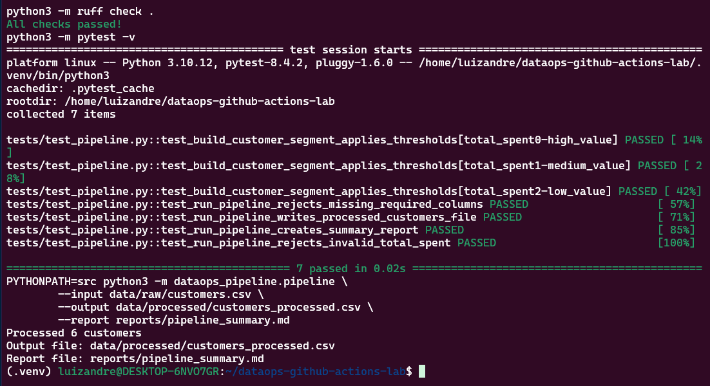
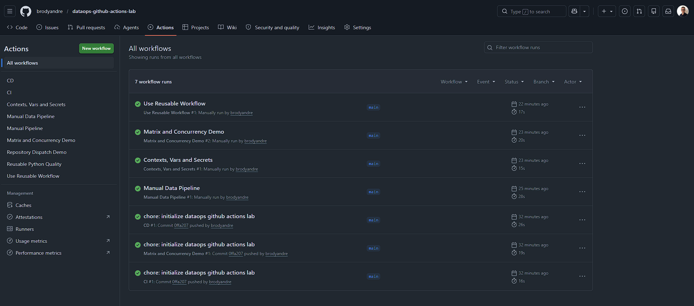
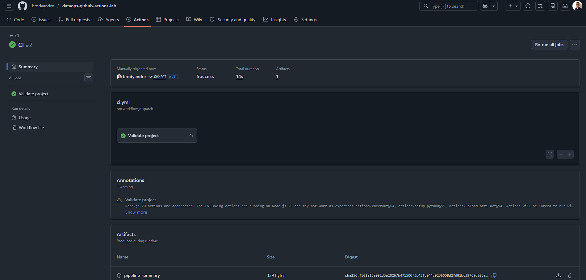
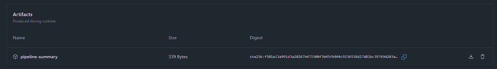
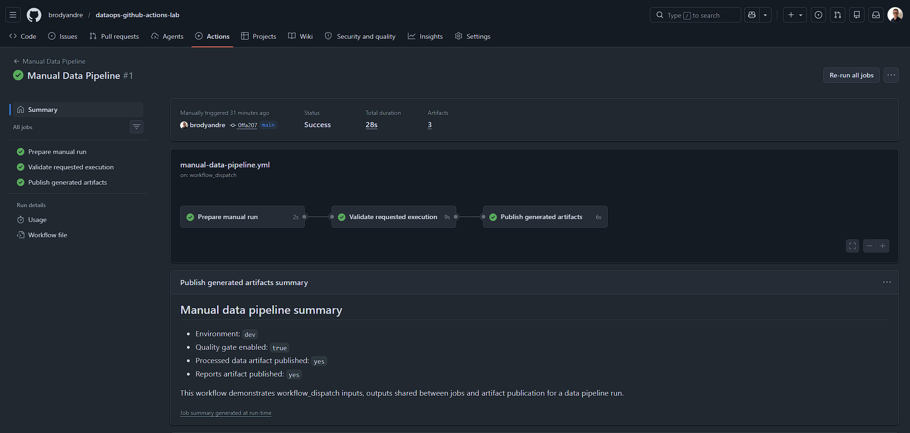
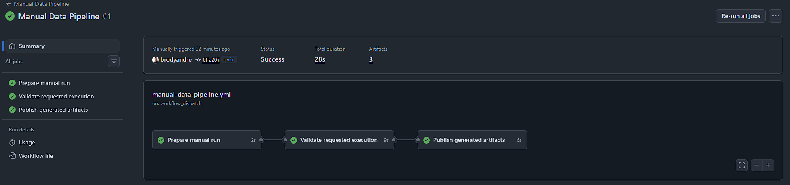
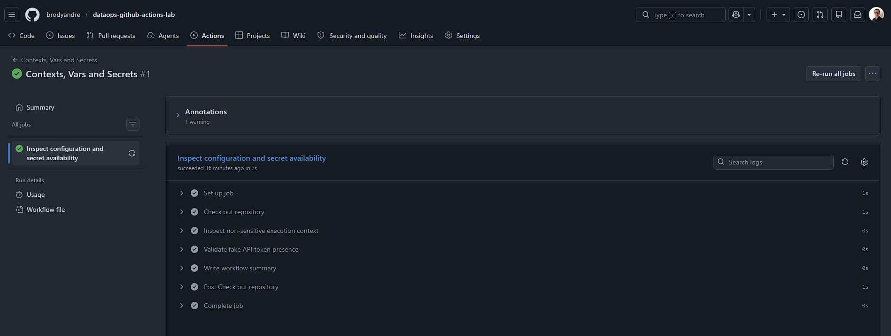
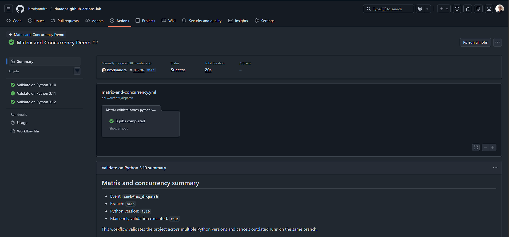
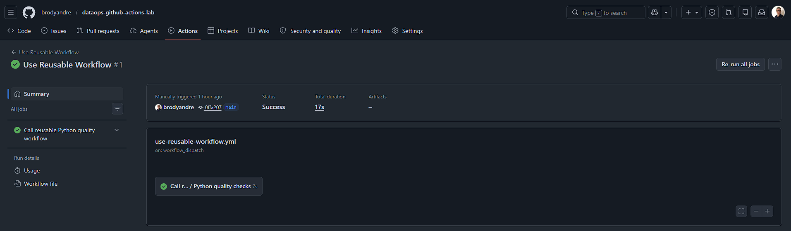
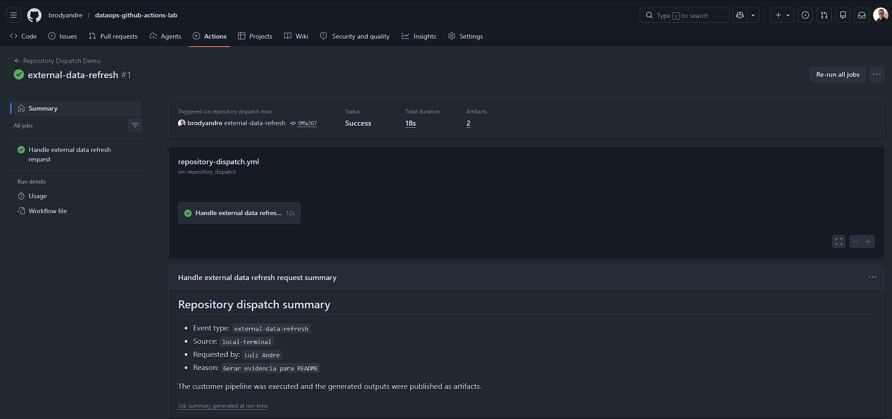

# dataops-github-actions-lab


Laboratório prático de DataOps com Python e GitHub Actions voltado para automação de pipelines, validação de dados, testes, publicação de artifacts e documentação operacional.

Este repositório não tenta simular uma plataforma inteira de dados. Ele trabalha em um recorte menor e mais verificável: como estruturar um pipeline simples de forma organizada, rastreável e fácil de revisar, tanto localmente quanto dentro do GitHub Actions.

O foco está menos em volume de tecnologia e mais em boas decisões de base: validação de entrada, testes úteis, automação consistente, evidência de execução e documentação clara. O CD do projeto é propositalmente simulado, sem deploy real em cloud, para manter o laboratório reproduzível e direto ao ponto.

<a id="indice"></a>
## Índice

- [Visão geral](#visao-geral)
- [Arquitetura](#arquitetura)
- [Estrutura do repositório](#estrutura-do-repositorio)
- [Workflows do GitHub Actions](#workflows-do-github-actions)
- [Execução local](#execucao-local)
- [Exemplos de execução](#exemplos-de-execucao)
- [Evidências de execução](#evidencias-de-execucao)
- [Competências demonstradas](#competencias-demonstradas)
- [Checklist técnico do laboratório](#checklist-tecnico-do-laboratorio)
- [Como este projeto se conecta com Engenharia de Dados](#como-este-projeto-se-conecta-com-engenharia-de-dados)
- [Revisão e colaboração](#revisao-e-colaboracao)
- [Troubleshooting](#troubleshooting)
- [Próximos passos](#proximos-passos)
- [Documentação complementar](#documentacao-complementar)
- [GitHub](#github)

<a id="visao-geral"></a>
## Visão geral

### Objetivo do projeto

O objetivo deste laboratório é servir como um repositório de portfólio com sinais práticos de trabalho em Engenharia de Dados, DataOps, DevOps e Cloud. Em vez de depender só de descrição teórica, ele mostra um pipeline simples funcionando com validação local, testes automatizados e workflows reais no GitHub Actions.

### O que o projeto entrega hoje

O núcleo do laboratório é um pipeline Python que lê um CSV de clientes, valida colunas obrigatórias, limpa campos de texto, segmenta clientes por faixa de gasto e gera dois produtos:

- `data/processed/customers_processed.csv`
- `reports/pipeline_summary.md`

Em volta desse pipeline, o repositório concentra workflows do GitHub Actions para:

- CI
- CD simulado com publicação de artifacts
- execução manual com inputs e outputs entre jobs
- demonstração de `env`, `vars`, `secrets` e `contexts`
- uso de `matrix`, `concurrency` e condicionais
- workflow reutilizável com `workflow_call`
- gatilho externo com `repository_dispatch`

O objetivo prático é mostrar como um pipeline de dados simples pode ser tratado com a mesma disciplina de engenharia aplicada a software: revisão, teste, automação, rastreabilidade e documentação.

[Voltar ao índice](#indice)

<a id="arquitetura"></a>
## Arquitetura

O fluxo principal do pipeline é este:

```text
data/raw/customers.csv
        |
        v
src/dataops_pipeline/pipeline.py
  - valida colunas obrigatórias
  - limpa espaços em branco
  - calcula customer_segment
        |
        +--> data/processed/customers_processed.csv
        |
        +--> reports/pipeline_summary.md
```

Acima dessa camada de transformação, o GitHub Actions atua como camada de automação e operação:

- valida código com `ruff`
- valida comportamento com `pytest`
- executa o pipeline em cenários controlados
- publica artifacts para inspeção
- registra contexto de execução e decisões operacionais

Esse desenho é intencionalmente simples. A ideia aqui não é resolver escala, e sim deixar claras as responsabilidades de cada parte do fluxo e deixar o raciocínio fácil de explicar em entrevista técnica.

[Voltar ao índice](#indice)

<a id="estrutura-do-repositorio"></a>
## Estrutura do repositório

```text
.
|-- .github/
|   |-- pull_request_template.md
|   `-- workflows/
|       |-- cd.yml
|       |-- ci.yml
|       |-- context-vars-secrets.yml
|       |-- manual-data-pipeline.yml
|       |-- matrix-and-concurrency.yml
|       |-- pipeline-manual.yml
|       |-- repository-dispatch.yml
|       |-- reusable-python-quality.yml
|       `-- use-reusable-workflow.yml
|-- data/
|   |-- processed/
|   `-- raw/
|-- docs/
|-- evidence/
|   `-- screenshots/
|       `-- README.md
|-- reports/
|-- src/dataops_pipeline/
|-- tests/
|-- Makefile
|-- README.md
|-- requirements-dev.txt
`-- requirements.txt
```

Diretórios principais:

- `src/dataops_pipeline/`: implementação do pipeline
- `tests/`: suíte automatizada com `pytest`
- `.github/workflows/`: workflows usados como laboratório de GitHub Actions
- `docs/`: explicações curtas e objetivas sobre os conceitos usados no projeto
- `evidence/screenshots/`: evidências visuais das execuções locais e dos workflows do GitHub Actions

[Voltar ao índice](#indice)

<a id="workflows-do-github-actions"></a>
## Workflows do GitHub Actions

O repositório usa GitHub Actions como a principal camada de automação do laboratório. A proposta aqui não é fazer deploy em cloud real: o CD é simulado por meio da publicação controlada de artifacts gerados pelo pipeline.

| Workflow | Trigger principal | Papel no laboratório |
| --- | --- | --- |
| `ci.yml` | `push`, `pull_request`, `workflow_dispatch` | Valida lint, testes, pipeline e gera o relatório como artifact. |
| `cd.yml` | `push` em `main` | Simula uma etapa de entrega contínua publicando saídas validadas do pipeline. |
| `pipeline-manual.yml` | `workflow_dispatch` | Executa o pipeline manualmente a partir de um arquivo informado no input. |
| `manual-data-pipeline.yml` | `workflow_dispatch` | Demonstra `inputs`, `outputs` entre jobs e publicação condicional de artifacts. |
| `context-vars-secrets.yml` | `workflow_dispatch` | Mostra uso prático de `env`, `vars`, `secrets` e `contexts`. |
| `matrix-and-concurrency.yml` | `push`, `pull_request`, `workflow_dispatch`, `schedule` | Demonstra matriz de versões de Python, condicionais e controle de concorrência. |
| `reusable-python-quality.yml` | `workflow_call` | Encapsula um fluxo reutilizável de lint, testes e execução opcional do pipeline. |
| `use-reusable-workflow.yml` | `workflow_dispatch` | Chama o workflow reutilizável com `inputs` e repasse de `secrets`. |
| `repository-dispatch.yml` | `repository_dispatch` | Simula um gatilho externo disparando o pipeline via GitHub API. |

Os arquivos em `docs/` explicam cada um desses temas com mais profundidade, sempre usando este repositório como referência e não um exemplo abstrato.

[Voltar ao índice](#indice)

<a id="execucao-local"></a>
## Execução local

O runtime do pipeline usa apenas a biblioteca padrão do Python. As dependências de desenvolvimento existem para lint e testes, o que mantém a execução local simples e previsível.

### Preparação do ambiente

Fluxo recomendado para uma validação local limpa:

```bash
python3 -m venv .venv
source .venv/bin/activate
make install
```

Se preferir não ativar a virtual environment, os comandos também podem ser executados informando o interpretador explicitamente:

```bash
make install PYTHON=.venv/bin/python
```

### Comandos disponíveis

| Comando | Uso |
| --- | --- |
| `make install` | Instala `requirements.txt` e `requirements-dev.txt`. |
| `make lint` | Executa `ruff`. |
| `make test` | Executa `pytest`. |
| `make run` | Roda o pipeline e gera CSV processado + relatório. |
| `make clean` | Remove arquivos gerados em `data/processed/` e `reports/`. |
| `make validate` | Roda `lint`, testes e pipeline em sequência. |

### Execução manual do pipeline

```bash
PYTHONPATH=src python3 -m dataops_pipeline.pipeline \
  --input data/raw/customers.csv \
  --output data/processed/customers_processed.csv \
  --report reports/pipeline_summary.md
```

[Voltar ao índice](#indice)

<a id="exemplos-de-execucao"></a>
## Exemplos de execução

### Fluxo local completo

```bash
python3 -m venv .venv
source .venv/bin/activate
make install
make validate
```

Saída esperada:

```text
All checks passed!
7 passed
Processed 6 customers
Output file: data/processed/customers_processed.csv
Report file: reports/pipeline_summary.md
```

### Exemplo de relatório gerado

```md
# Pipeline Summary

- Input file: `data/raw/customers.csv`
- Output file: `data/processed/customers_processed.csv`
- Processed records: 6
```

### Exemplo de execução manual no GitHub Actions

Um cenário útil para demonstração é disparar `manual-data-pipeline.yml` com:

- `environment = staging`
- `run_quality_gate = true`

Nesse caso, o workflow valida o projeto, executa o pipeline e publica `data/processed/` e `reports/` como artifacts da run. Esse tipo de fluxo é útil para mostrar controle operacional sem precisar alterar código a cada cenário de teste.

[Voltar ao índice](#indice)

<a id="evidencias-de-execucao"></a>
## Evidências de execução

As imagens abaixo registram execuções reais do projeto. Elas ajudam a mostrar que o laboratório não ficou restrito ao YAML ou à documentação: o pipeline foi validado localmente, os workflows rodaram no GitHub Actions e as saídas foram publicadas como artifacts quando isso fazia sentido para o fluxo de dados.

Para quem está avaliando o repositório, essa seção funciona como evidência prática de automação, validação e rastreabilidade. As orientações da pasta continuam em [evidence/screenshots/README.md](evidence/screenshots/README.md).

### Validação local do pipeline

Este print mostra o caminho mais importante para quem vai manter o projeto no dia a dia: `ruff`, `pytest` e execução do pipeline na mesma rotina local. Para um laboratório de DataOps, isso comprova que a base funciona antes mesmo de entrar no CI.

<p>
  
</p>

### Visão operacional no GitHub Actions

A lista de workflows mostra o escopo do laboratório no GitHub Actions. Aqui aparecem os fluxos de CI, CD simulado, execução manual, matrix, reusable workflow, `repository_dispatch` e checagem de configuração com `vars` e `secrets`.

<p>
  
</p>

### CI executado com sucesso

Esta execução confirma que o repositório passa pelo mesmo ritual fora da máquina local: lint, testes e execução do pipeline em um runner hospedado pelo GitHub.

<p>
  
</p>

### Artifact gerado pelo CI

O artifact `pipeline-summary` funciona como rastro verificável da validação. Em Engenharia de Dados, esse tipo de evidência ajuda a inspecionar a saída do pipeline sem depender apenas de logs.

<p>
  
</p>

### Workflow manual com inputs

Essas duas imagens registram a execução manual do workflow `manual-data-pipeline.yml`, usado para demonstrar `workflow_dispatch`, `inputs`, `outputs` entre jobs e publicação de artifacts. A primeira mostra a run concluída. A segunda complementa a mesma execução manual dentro do contexto do workflow.

<p>
  
  
</p>

### Contexts, vars e secrets

Esta execução comprova o uso controlado de `env`, `vars`, `secrets` e `contexts`. O foco aqui não é consumir um token real, e sim mostrar a estrutura correta para configuração operacional sem expor dado sensível.

<p>
  
</p>

### Matrix build

O matrix build registra a validação do projeto em múltiplas versões de Python. Para um pipeline simples, isso já mostra preocupação com compatibilidade de runtime e estabilidade da automação.

<p>
  
</p>

### Workflow reutilizável com `workflow_call`

Esta evidência mostra a chamada do workflow consumidor para o workflow reutilizável. Em um contexto mais amplo de DevOps e DataOps, isso ajuda a evitar duplicação de lógica de qualidade entre repositórios.

<p>
  
</p>

### `repository_dispatch` simulando evento externo

Este cenário registra um disparo externo com `client_payload`. No contexto de Engenharia de Dados, esse padrão é útil para integrar o repositório com orquestradores, jobs de ingestão, automações de plataforma ou eventos de atualização de dados.

<p>
  
</p>

[Voltar ao índice](#indice)

<a id="competencias-demonstradas"></a>
## Competências demonstradas

- Estruturação de pipeline Python com funções pequenas, legíveis e fáceis de testar.
- Validação de dados de entrada e aplicação de regra de negócio simples com saída rastreável.
- Padronização de qualidade local com `Makefile`, `ruff` e `pytest`.
- Automação de CI para lint, testes e execução do pipeline no GitHub Actions.
- CD simulado com publicação de artifacts, sem depender de infraestrutura paga.
- Uso prático de `workflow_dispatch`, `workflow_call`, `repository_dispatch`, `matrix`, `concurrency`, `artifacts`, `env`, `vars`, `secrets` e `contexts`.
- Organização de revisão e colaboração com Pull Request Template e documentação de apoio.

[Voltar ao índice](#indice)

<a id="checklist-tecnico-do-laboratorio"></a>
## Checklist técnico do laboratório

- [x] Pipeline Python local.
- [x] Testes automatizados com `pytest`.
- [x] Lint com `ruff`.
- [x] `Makefile` para padronizar comandos.
- [x] CI com GitHub Actions.
- [x] CD simulado com artifacts.
- [x] Workflow manual com `workflow_dispatch`.
- [x] Inputs em workflows manuais.
- [x] Outputs entre jobs.
- [x] Artifacts para relatórios e saídas do pipeline.
- [x] Variáveis de ambiente (`env`).
- [x] Repository variables (`vars`).
- [x] Secrets.
- [x] Contexts do GitHub Actions.
- [x] Matrix strategy.
- [x] Condicionais em workflows.
- [x] Concurrency.
- [x] Workflow reutilizável com `workflow_call`.
- [x] Reaproveitamento de workflow com repasse de `secrets`.
- [x] `repository_dispatch`.
- [x] Pull Request Template.
- [x] Evidências reais em `evidence/screenshots/`.
- [x] Documentação complementar em `docs/`.

[Voltar ao índice](#indice)

<a id="como-este-projeto-se-conecta-com-engenharia-de-dados"></a>
## Como este projeto se conecta com Engenharia de Dados

Este laboratório conversa com Engenharia de Dados em pontos bem concretos:

- o pipeline valida contrato mínimo de entrada antes de gerar saída
- o processamento é reproduzível e gera um relatório simples para auditoria
- os workflows tratam dados processados e relatórios como artifacts verificáveis
- o repositório mostra padrões de integração com gatilhos externos e múltiplos cenários de execução
- o fluxo de revisão considera impacto em automação, rastreabilidade e documentação

No recorte de DataOps e DevOps, o ganho está em tratar o pipeline como software versionado, testável e automatizado. No recorte de Cloud, o projeto não faz deploy real, mas já organiza a base para uma evolução natural para storage, orquestração e publicação de artefatos em ambientes gerenciados.

Em um ambiente maior, a mesma lógica poderia ser conectada a storage, orquestração, catálogos ou jobs distribuídos. Aqui, o foco está em deixar a base limpa, compreensível e fácil de evoluir.

[Voltar ao índice](#indice)

<a id="revisao-e-colaboracao"></a>
## Revisão e colaboração

O projeto usa `.github/pull_request_template.md` para manter um padrão mínimo de revisão. Cada PR deve trazer:

- resumo da alteração
- evidências de teste
- impacto em CI/CD
- riscos e observações

Isso torna o histórico do repositório mais útil para quem revisa, para quem retoma contexto depois e para quem quer avaliar a maturidade do fluxo de entrega.

[Voltar ao índice](#indice)

<a id="troubleshooting"></a>
## Troubleshooting

| Sintoma | O que verificar |
| --- | --- |
| `pytest` ou `ruff` não encontrado | Rode `make install`. |
| `ModuleNotFoundError: dataops_pipeline` em execução manual | Use `make run` ou defina `PYTHONPATH=src`. |
| `reports/pipeline_summary.md` não existe | Rode `make run` ou `make validate` após `make clean`. |
| Workflow manual não publicou artifacts | Verifique se `run_quality_gate` foi executado como `true`. |
| `PROJECT_ENV` ou `FAKE_API_TOKEN` não aparecem nos workflows de demonstração | Configure o valor em `Settings > Secrets and variables > Actions`. |
| O README parece falar em deploy, mas o projeto não publica nada em cloud | O workflow `cd.yml` representa um CD simulado com artifacts, não um deploy real. |

[Voltar ao índice](#indice)

<a id="proximos-passos"></a>
## Próximos passos

As evoluções abaixo fazem sentido para a próxima fase do laboratório, mas não fazem parte do escopo implementado hoje. A ideia é expandir o projeto sem perder o foco em DataOps, CI/CD e Engenharia de Dados.

- publicar o relatório do pipeline em GitHub Pages para transformar a saída da execução em uma evidência navegável
- adicionar validações de qualidade de dados mais robustas, como checagem de nulos, duplicidade e faixas esperadas
- integrar o projeto com Docker para padronizar o ambiente local e facilitar demonstrações
- simular um deploy em ambiente gratuito ou local, mantendo a proposta de CD controlado sem depender de cloud paga
- adicionar cobertura de testes para acompanhar melhor a evolução do pipeline
- configurar branch protection rules no GitHub para reforçar revisão e validação antes de merge
- complementar os badges do repositório com status mais próximos da rotina de CI/CD
- integrar notificações de falha para dar mais visibilidade a execuções quebradas
- incluir um exemplo de Pull Request preenchido com o template do projeto

[Voltar ao índice](#indice)

<a id="documentacao-complementar"></a>
## Documentação complementar

Os arquivos em `docs/` aprofundam os pontos que aparecem nos workflows:

- `docs/github-actions-concepts.md`
- `docs/ci-cd.md`
- `docs/runners-vars-secrets.md`
- `docs/inputs-outputs-artifacts.md`
- `docs/triggers-matrix-concurrency.md`
- `docs/reusable-workflows.md`
- `docs/repository-dispatch.md`
- `docs/gitflow-vs-github-flow.md`

[Voltar ao índice](#indice)

<a id="github"></a>
## GitHub

Perfil: https://github.com/brodyandre

[Voltar ao índice](#indice)
